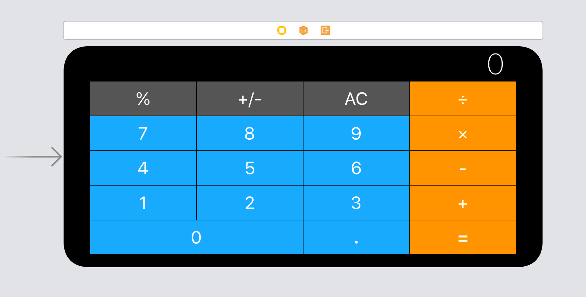

# Calculator Layout Boss Challenge

No knowledge is your own until you put it into practice. Using what i've learned about auto layout, stack views and setting constraints, created the following UI. 

## Portrait

## Landscape

>This is a companion project to The App Brewery's Complete App Development Bootcamp, check out the full course at [www.appbrewery.co](https://www.appbrewery.co/)

